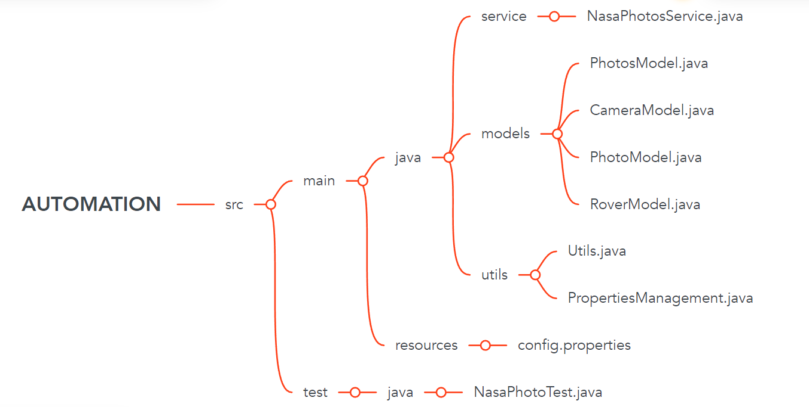

# Considerations

## Required Software 
* Java JDK 8+
* Maven installed and in your classpath

## How to execute the tests
If you run `mvn test` all the tests will execute because it's the regular Maven lifecycle to run all the tests.
However, it's possible running for generating test reporsts using the command `mvn clean test allure:report`. 
Also, is possible to execute these tests by pushing or doing a PR in a fork of this project. <- for reporting purposes is important to fork the branches aswell.

### Generating the test report

This project uses Allure Report to automatically generate the test report.
There are some configuration to make it happen:
* aspectj configuration on `pom.xml` file
* `allure.properties` file on `src/test/resources`

You can use the command line to generate it in two ways:
* `mvn allure:serve`: will open the HTML report into the browser

## About the Project Structure

Through this mind map we can have a macro vision about how the project is structured:

See that `test` folder directory is all about abstracting the logical implanted inside `main` folder.

## Libraries
* [RestAssured](http://rest-assured.io/) library to test REST APIs
* [JUnit 5](https://junit.org/junit5/) to support the test creation
* [Hamcrest](https://hamcrest.org/JavaHamcrest/) to manage the property files
* [Allure Report](https://docs.qameta.io/allure/) as the testing report strategy

## Pipeline
This project uses [GitHub Actions](https://github.com/features/actions) to run the all the tests in a pipeline.
The idea is to simulate a real life CI Pipeline where we'd run a switch of tests automatically when deploying some new feature into `master` branch.
Also, for this purpose, this projects is useing a plugin called `peaceiris`. This way, we can access the last execution reports throught this link: https://tonymich19.github.io/SDET-Backend-Challenge/3/
